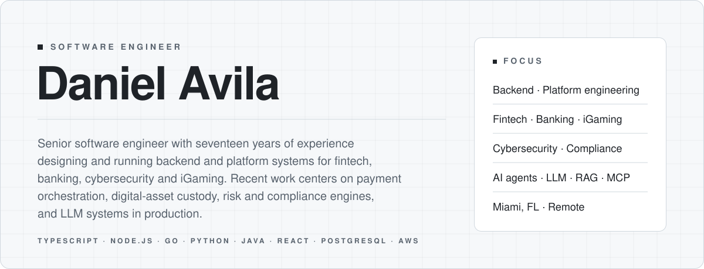
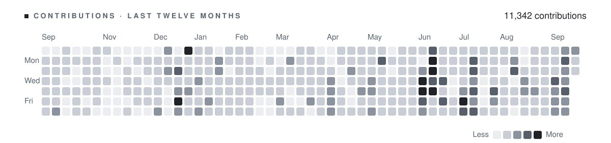
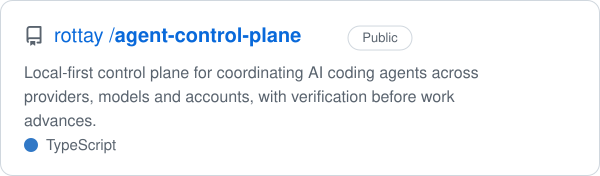
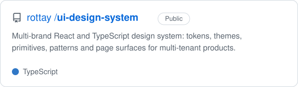

<picture>
  <source media="(prefers-color-scheme: dark)" srcset="assets/header-dark.svg">
  <source media="(prefers-color-scheme: light)" srcset="assets/header-light.svg">
  
</picture>

  <a href="https://www.linkedin.com/in/avila-daniel/"><picture><source media="(prefers-color-scheme: dark)" srcset="assets/contact-linkedin-dark.svg"><source media="(prefers-color-scheme: light)" srcset="assets/contact-linkedin-light.svg"></picture></a>
  &nbsp;&nbsp;
  <a href="https://linktr.ee/davila23"><picture><source media="(prefers-color-scheme: dark)" srcset="assets/contact-linktree-dark.svg"><source media="(prefers-color-scheme: light)" srcset="assets/contact-linktree-light.svg"></picture></a>
  &nbsp;&nbsp;
  <a href="mailto:daniel.avila@rottay.com"><picture><source media="(prefers-color-scheme: dark)" srcset="assets/contact-email-dark.svg"><source media="(prefers-color-scheme: light)" srcset="assets/contact-email-light.svg"></picture></a>

 

## About

Seventeen years as a software engineer, drawn to the work that changes a
product: migrations that cannot fail, features built from scratch, and
problems where the result is measured by the business rather than by the
ticket. I like owning things end to end, from the domain model to what the
user sees, and I bring a product view to engineering decisions.

Most of those years were spent on the backend of systems where mistakes are
expensive: telephone banking serving fifty thousand callers a day,
health-insurance quoting under regulatory constraints, a notifications
platform moving half a million messages a day, a security-compliance product
built to FedRAMP requirements, and a regulated real-money gaming platform with
its own payments, custody and risk stack.

Today my work is taking features end to end with full ownership and autonomy,
from the first conversation about the problem to production, leveraging AI
tooling and agent orchestration across the whole cycle. I have been an early
adopter of these tools since the first usable models, and they are now part
of how I design, build, test and review.

## Technologies

<picture>
  <source media="(prefers-color-scheme: dark)" srcset="assets/technologies-dark.svg">
  <source media="(prefers-color-scheme: light)" srcset="assets/technologies-light.svg">
  
</picture>

 

## Contributions

<picture>
  <source media="(prefers-color-scheme: dark)" srcset="assets/contributions-dark.svg">
  <source media="(prefers-color-scheme: light)" srcset="assets/contributions-light.svg">
  
</picture>

 

## Open source

  <a href="https://github.com/rottay/agent-control-plane"><picture><source media="(prefers-color-scheme: dark)" srcset="assets/pin-agent-control-plane-dark.svg"><source media="(prefers-color-scheme: light)" srcset="assets/pin-agent-control-plane-light.svg"></picture></a>
  <a href="https://github.com/rottay/ui-design-system"><picture><source media="(prefers-color-scheme: dark)" srcset="assets/pin-ui-design-system-dark.svg"><source media="(prefers-color-scheme: light)" srcset="assets/pin-ui-design-system-light.svg"></picture></a>

 

### [Agent Control Plane](https://github.com/rottay/agent-control-plane)

A local-first control plane for running AI coding agents as a team instead of
as separate chats. Each responsibility in a workflow, such as clarifying the
request, implementing, verifying and reviewing, is assigned to a provider,
model and account of your choice, with explicit boundaries on what that agent
may read, change, call or spend. Every step declares what it must deliver and
which evidence is required before the work is allowed to advance, so a task
moves forward on verified results rather than on an agent saying it is done.

When an account runs out of quota or a step fails, the plan pauses, recovers
or hands off to a compatible worker without losing the work already done.
TypeScript, provider-agnostic, built to swap tools without rebuilding the
workflow.

 

### [Design System](https://github.com/rottay/ui-design-system)

A React and TypeScript design system for multi-tenant products, where every
customer gets a distinct visual identity over the same shared components.
A bounded set of tenant decisions, covering typography, shape, spacing,
surfaces, interaction states and motion, cascades through tokens, themes and
four composition tiers: primitives, patterns, structures and page surfaces.

The result is white-label differentiation that goes well beyond swapping a
primary color, with the same accessibility, interaction and responsive quality
whether a tenant customizes a little or a lot. Includes a tenant theme editor
contract, a component catalog with ownership rules, and verification gates
that keep each identity honest.
